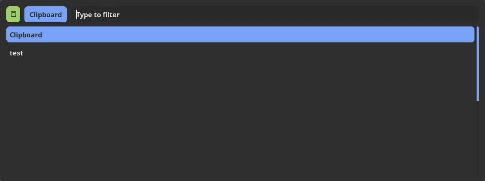

# Preview

## Clipcat



# Installation of clipcat

## Prerequisites

- Linux with `clipcat` installed.

## Installation of the prerequisites

### Arch Linux

#### Install `clipcat`

```bash
sudo pacman -S clipcat
```

### Debian Based

#### Install `clipcat`

Check the official repository for the installation information : [clipcat](https://github.com/xrelkd/clipcat/blob/develop/docs/INSTALL.md#debian-and-ubuntu-derivatives)

## Install the configuration

```bash
git clone https://github.com/skignes/Dotfiles.git
cd Dotfiles/clipcat
```

### Copy the config file

```bash
mkdir -p ~/.config/clipcat
cp conf/clipcat* ~/.config/clipcat/
```

You also need the rofi theme :

```bash
mkdir -p ~/.config/rofi/
cp ../rofi/themes/Clipboard.rasi ~/.config/rofi/
```

### Start by default the clipboard manager

If you use `i3` you can add this inside your configuration :

```bash
exec --no-startup-id clipcatd
```

And now you can use this command :

```bash
clipcat-menu
```

This will open rofi with the theme and you can select the clips you want !
