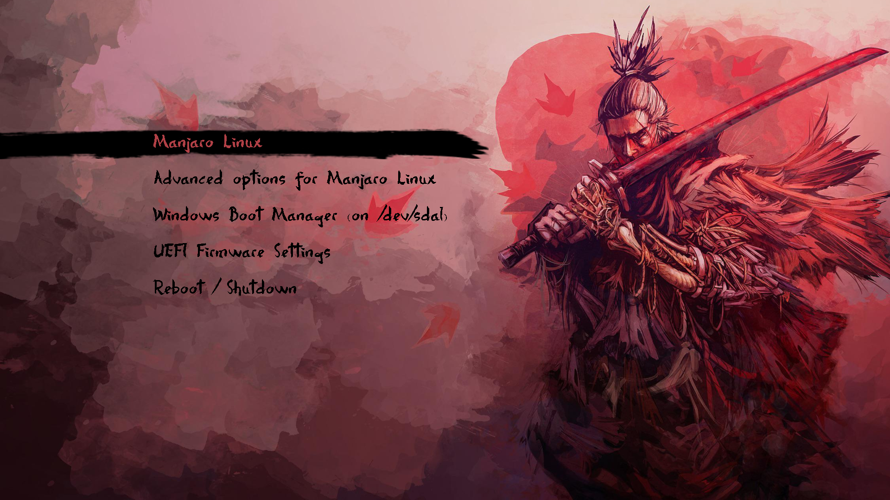

# Previews

## Tokyo Night


## Sekiro



# Installation of Grub Themes

## Prerequisites

- Linux with `grub` on it/
- `root` or `sudo` to install the themes.

## Install the Themes

### Download the theme

```bash
git clone https://github.com/skignes/Dotfiles.git
cd Dotfiles/grub
```

### Copy the theme inside the theme emplacement

> [!WARNING]
> There is 2 emplacement where you can set your theme. One of emplacement will not work if you have your disk encrypted.

#### Disk not Encrypted

```bash
sudo cp -r [THEME_YOU_WANT] /usr/share/grub/themes/
```

#### Disk Encrypted

```bash
sudo cp -r [THEME_YOU_WANT] /boot/grub/themes/
```

### Edit grub File

```bash
sudo nvim /etc/default/grub
```

#### Disk not Encrypted

Change this line :

```bash
#GRUB_THEME=
```

into :

#### Disk not Encrypted

```bash
GRUB_THEME="/usr/share/grub/themes/[THEME_YOU_WANT]/theme.txt"
```

#### Disk Encrypted

```bash
GRUB_THEME="/boot/grub/themes/[THEME_YOU_WANT]/theme.txt"
```

## Save the configuration

```bash
sudo grub-mkconfig -o /boot/grub/grub.cfg
```

## Acknowledgments

- [Tokyo Night](https://github.com/mino29/tokyo-night-grub)
- [Sekiro](https://github.com/semimqmo/sekiro_grub_theme)
