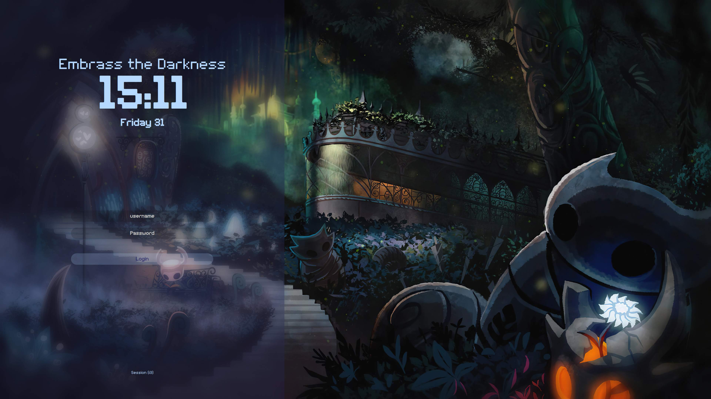

# Preview

## Hollow Knight



# Installation of SDDM Themes

## Prerequisites

- Linux with `sddm` installed.
- `root` or `sudo` to install the themes.

## Installation of the prerequisites

### Arch Linux

> Install `sddm`

```bash
sudo pacman -S sddm
```

### Debian Based

> Install `sddm`

```bash
sudo apt install sddm
```

> Define `sddm` as the default session manager

```bash
sudo systemctl enable sddm.service
```

If you have another **session manager** then you need to disable it. For example with gdm :

```bash
sudo systemctl disable gdm.service
```

> Then you can reboot the PC to have sddm has the session manager

```bash
sudo reboot now
```

## Install the Themes

> Download the theme

```bash
git clone https://github.com/skignes/Dotfiles.git
cd Dotfiles/sddm
```

> Copy the themes into the sddm theme emplacement

```bash
sudo cp -r [theme-you-want] /usr/share/sddm/themes/
```

> Modify the theme you want to use

```bash
sudo nvim /etc/sddm.conf
```

If the file doesn't exist then create it. And put this inside :

```conf
[Theme]
    Current=[theme-you-want]
```

> Reboot or restart sddm

```bash
sudo reboot now
sudo systemctl restart sddm.service
```

## Preview your theme

To preview your theme you can run this command :

```bash
sddm-greeter-qt6 --test-mode --theme /usr/share/sddm/themes/Hollow_Knight/
```

## Acknowledgments

- [Keyitdev](https://github.com/Keyitdev/sddm-astronaut-theme)
- [Sddm-Sugar-Dark](https://github.com/MarianArlt/sddm-sugar-dark)
